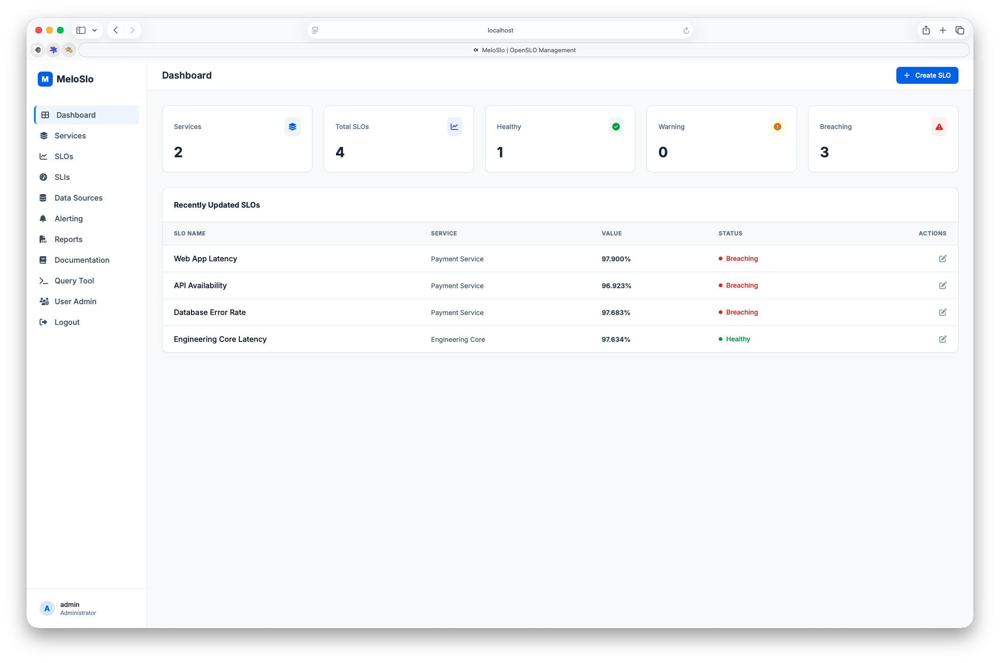
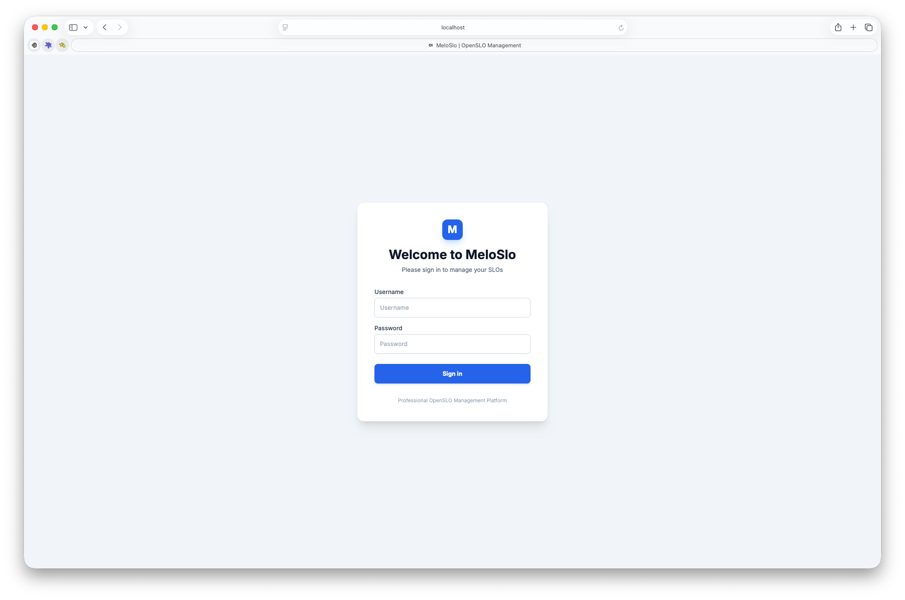
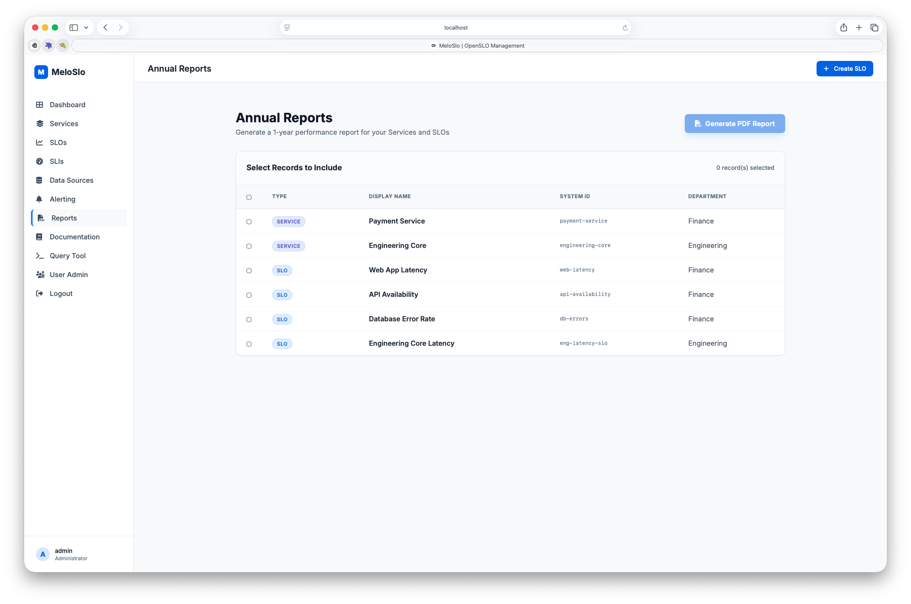

# MeloSlo User Guide

Welcome to **MeloSlo**, an application for managing Service Level Objectives (SLOs) using the OpenSLO specification. This guide will help you understand the core concepts and how to use the various features of the application.

## Table of Contents
1. [Introduction](#introduction)
2. [Authentication and Access Control](#authentication-and-access-control)
3. [Core Concepts](#core-concepts)
4. [How to Use MeloSlo](#how-to-use-meloslo)
    - [1. Create a Service](#1-create-a-service)
    - [2. Define Data Sources](#2-define-data-sources)
    - [3. Define Service Level Indicators (SLIs)](#3-define-service-level-indicators-slis)
    - [4. Create Service Level Objectives (SLOs)](#4-create-service-level-objectives-slos)
    - [5. Set Up Alerting](#5-set-up-alerting)
5. [Monitoring and Reporting](#monitoring-and-reporting)
    - [Dashboard](#dashboard)
    - [Reporting](#reporting)
6. [Tools and Administration](#tools-and-administration)
    - [Query Tool](#query-tool)
    - [User Administration](#user-administration)

---

## Introduction
MeloSlo allows teams to define their reliability goals, error budgets, and indicators in a consistent way across different monitoring tools.

## Authentication and Access Control
MeloSlo implements secure authentication and department-based access control.

- **Role: Administrator (Full Access)**: Administrators can see and manage all records across the entire application and access User Admin and Database Query tools.
- **Role: Restricted User**: Users assigned to one or more departments only see records belonging to those departments (e.g., 'Finance', 'Engineering').

### Test Accounts:
- **Admin**: `admin / admin`
- **Test (Finance & Engineering)**: `testuser / testuser`

---

## Core Concepts
- **Service**: A logical collection of SLOs.
- **SLI (Indicator)**: A metric that tells you how your service is performing (e.g., Latency, Error Rate). All metrics must be in the range 0 to 100.
- **SLO (Objective)**: A target value for an SLI over a specific time window.
- **Data Source**: A record defining where metrics come from (e.g. Prometheus). Supports custom Refresh Rates (min 15m).
- **Error Budget**: The amount of unreliability you can afford before violating your SLO.
- **Alerting Source**: A record defining a webhook (e.g. Slack) to notify when an SLO is breached.
- **Status Thresholds**: SLOs are **Healthy** (Budget ≥ 25%), **Warning** (0% to 25%), or **Breaching** (< 0%).

---

## How to Use MeloSlo

### Creating Records
You can create new Services, SLIs, or SLOs by clicking the 'Create' button found on their respective overview pages. This will open a modal where you can provide the necessary details, including the OpenSLO specification in YAML or JSON format.

### 1. Create a Service
Start by defining the Service that owns the reliability goals. Go to 'Services' and click 'Create'.

### 2. Define Data Sources
Define where your metrics will be pulled from. Supported types include Prometheus and Datadog.

### 3. Define Service Level Indicators (SLIs)
Define the SLI by providing a query snippet for your data source.

### 4. Create Service Level Objectives (SLOs)
Link your SLI to a target value and time window to create an SLO.

### 5. Set Up Alerting
Configure Alerting Sources to receive notifications when your SLOs are breaching.

---

## Monitoring and Reporting

### Dashboard
The Dashboard provides an overview of all your services and SLOs, highlighting those that are currently breaching their objectives.

### Reporting
Generate annual performance reports for your Services and SLOs in PDF format.

---

## Tools and Administration

### Query Tool
Administrators can use the Query Tool to directly query the underlying database for troubleshooting or custom analysis.

### User Administration
Manage users, roles, and department assignments.

